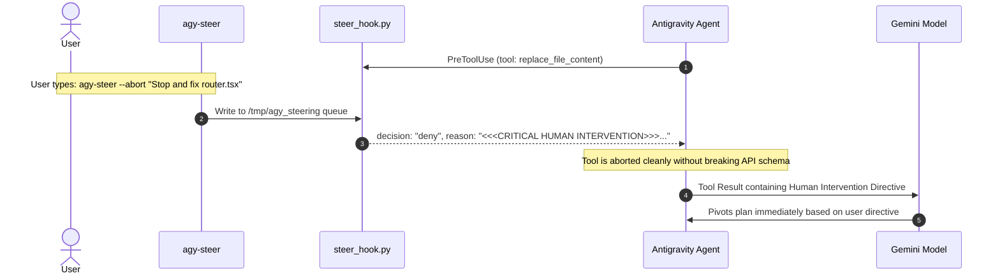

# In-Flight Steering & Context Compaction for Antigravity

This directory contains a complete, working reference implementation of:
1. **In-Flight Steering via Tool Response Hijacking** (using Antigravity Lifecycle Hooks).
2. **Context Compaction Skill (`/compact`)** (using the Antigravity Skills system).

---

## 1. Architecture Overview

### Steering Mechanism (`hooks.json` + `steer_hook.py`)
Instead of violating Gemini/OpenAI API schema rules by inserting rogue messages, we use Antigravity's native `PreToolUse` and `PreInvocation` hooks:



### Context Compaction (`skills/compact/SKILL.md`)
When invoked via `/compact`, the agent:
1. Synthesizes objectives, file changes, and active constraints.
2. Writes an executive snapshot into `compacted_context.md`.
3. Prunes low-value intermediate logs to recover context space while preventing amnesia.

---

## 2. Directory Structure

```text
examples/steering-and-compact/
├── hooks.json                     # Antigravity hook definition for PreToolUse & PreInvocation
├── scripts/
│   └── steer_hook.py              # Hook runner that checks the steering queue and aborts/injects
├── bin/
│   └── agy-steer                  # Command-line utility to send steering directives
├── skills/
│   ├── steer_hook.py              # Hook runner for Steering & Auto-Approval Guard
│   └── model_security_guard.py    # Model-driven evaluator (Gemini/Claude/OpenAI/Ollama)
├── bin/
│   └── agy-steer                  # Command-line utility to send steering directives
├── skills/
│   └── compact/
│       └── SKILL.md               # /compact skill definition and compaction workflow
├── tests/
│   ├── test_steering_hook.py      # Automated unit tests for Steering
│   └── test_model_guard.py        # Automated unit tests for Model Guard
└── README.md
```

---

## 3. Model-Driven Security Guard (No Whitelist Required)

Like Claude Code and Codex, `model_security_guard.py` evaluates every `run_command` via a lightweight evaluator model:
- **Zero Whitelists**: 100% semantic reasoning of developer intent and risk.
- **Auto-Approval (`allow`)**: Safe dev activities (compile, test, lint, view git diff, clean build folders).
- **Interactive Escalation (`ask`)**: High-risk activities (destructive code deletion, force pushes, accessing ssh secrets).
- **Supported Evaluator Backends**:
  - `GEMINI_API_KEY`: Ultra-fast `gemini-2.5-flash-lite` (~200ms latency).
  - `ANTHROPIC_API_KEY`: `claude-3-5-haiku-20241022` (identical to Claude Code).
  - `OPENAI_API_KEY`: `gpt-4o-mini` (identical to Codex).
  - `OLLAMA_HOST`: Local offline model (e.g. `qwen2.5-coder:1.5b` or `llama3.2:1b`).
  - Fallback: Native `agy --print` using your existing login.

---

## 4. How to Use in Your Workspace

### Step 1: Enable Hooks and Skills in your Project
To enable this in your current workspace, link or copy the configuration into your project's `.agents` directory:

```bash
mkdir -p .agents/scripts .agents/skills/compact
cp examples/steering-and-compact/hooks.json .agents/hooks.json
cp examples/steering-and-compact/scripts/* .agents/scripts/
chmod +x .agents/scripts/*.py
cp examples/steering-and-compact/skills/compact/SKILL.md .agents/skills/compact/SKILL.md
```

### Step 2: In-Flight Steering
While Antigravity is running in one terminal, open another terminal (or split pane) and run:

```bash
# Send a steering instruction (applied before next step)
./bin/agy-steer "Please switch your focus to router.tsx"

# Immediately abort the currently running tool and force pivot
./bin/agy-steer --abort "Stop modifying auth.ts, look at user.ts instead"

# Check active session and pending queue
./bin/agy-steer --status
```

### Step 3: Trigger Context Compaction
In your Antigravity chat session, type:
```text
/compact
```
The agent activates the compaction skill, creating a structured context artifact and discarding ephemeral logs.

---

## 5. Running the Tests

```bash
python3 examples/steering-and-compact/tests/test_model_guard.py
python3 examples/steering-and-compact/tests/test_steering_hook.py
```
